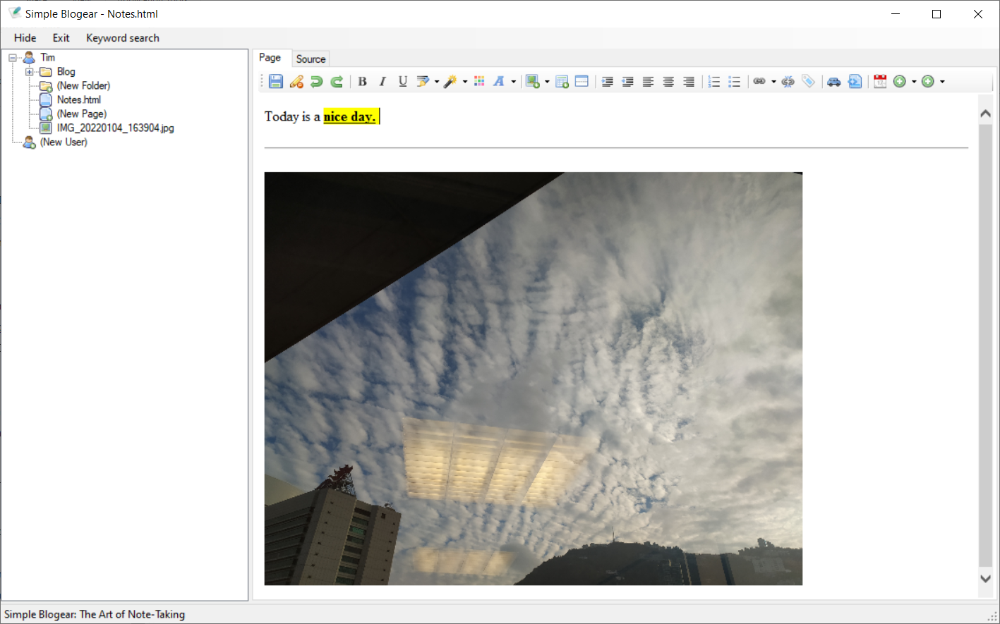

# Blogear
An offline blogging tool that was created in 2008.

HTML formatted files allow blogging with media and text styles, using Microsoft in-built WYSIWYG editor.

## How To Use

Run blocal.exe. You can click New User and so on.

## Screenshot

